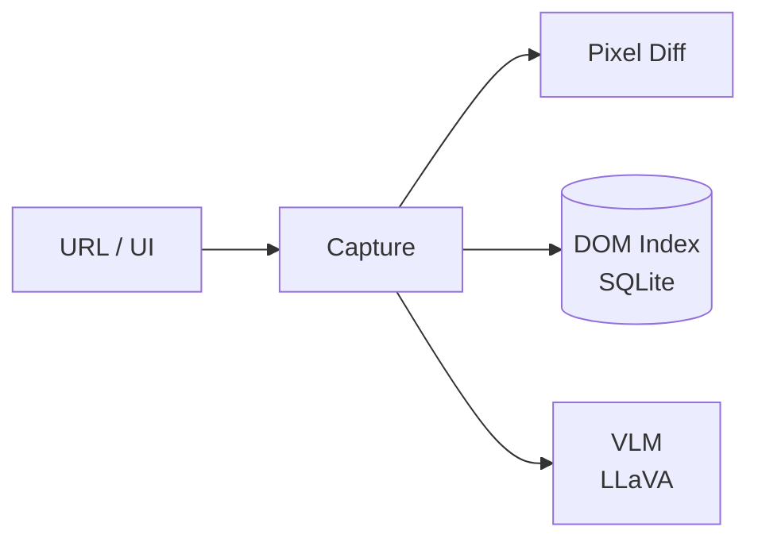

# agent-eyes

**Observability and visual QA — capture, diff, DOM indexing, and local VLM.**

`agent-eyes` captures URLs, runs pixel diffs, indexes DOM into SQLite, and optionally describes images with LLaVA via candle.



Standalone: `agent-eyes capture` · Integrated: spine events (`eyes.captured`, `eyes.dom.indexed`, `eyes.vlm.described`).

---

## Install

```bash
curl -fsSL https://raw.githubusercontent.com/autonomic-ai-dev/agent-eyes/master/scripts/install.sh | bash
```

---

## Quick start

```bash
agent-eyes status
agent-eyes capture https://example.com -o shot.png
agent-eyes diff baseline.png current.png
agent-eyes dom index https://localhost:3000
agent-eyes vlm describe shot.png --prompt "Describe the UI"
agent-eyes serve                    # HTTP :3105
```

---

## Commands

| Command | Description |
|---------|-------------|
| `capture` | Download URL to image file |
| `diff` | Pixel diff with diff image output |
| `describe` | Page / file structure analysis |
| `verify` | UI regression vs baseline |
| `dom index\|file\|stats\|search` | SQLite DOM index |
| `vlm describe\|status` | Local LLaVA (requires `--features vlm` build) |
| `serve` | HTTP daemon |

---

## HTTP API

| Endpoint | Description |
|----------|-------------|
| `GET /health` | Daemon health |
| `POST /capture` · `POST /diff` | Capture and compare |
| `POST /dom/index` · `GET /dom/search` | DOM index |
| `GET /vlm/status` · `POST /vlm/describe` | Vision model |

DOM database: `~/.autonomic/memory/eyes_dom.db`

---

## Configuration

Section `[eyes]` in `~/.autonomic/config.toml` (default port **3105**).

```toml
[vlm]
enabled = true
model_id = "llava-hf/llava-1.5-7b-hf"
```

Build with VLM: `cargo build --release -p agent-eyes --features vlm`

---

## Development

```bash
cargo test --release -p agent-eyes
```

---

## License

MIT
