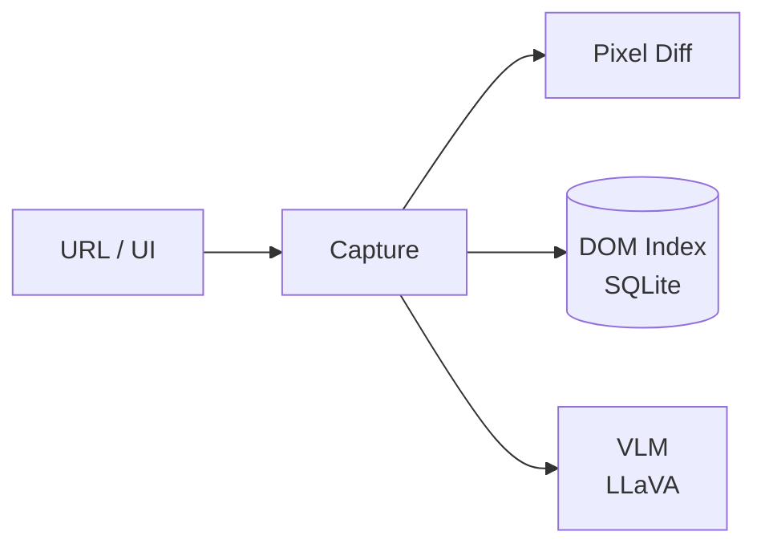

# agent-eyes

**Observability and visual QA — capture, diff, DOM indexing, and local VLM.**

Part of the **[Autonomic AI](https://github.com/autonomic-ai-dev/agent-body)** ecosystem. Captures URLs, runs pixel diffs, indexes DOM into SQLite, and optionally describes images with LLaVA via candle.

| Standalone | Integrated |
|------------|------------|
| `agent-eyes capture` | Spine events (`eyes.captured`, `eyes.dom.indexed`) |
| `agent-eyes dom index <url>` | HTTP **3105** |
| Local HTML via HTTP server | `[eyes]` in unified config |

---

## Why agent-eyes?

| Problem | agent-eyes answer |
|---------|-------------------|
| Agents can't "see" the UI | **`capture`** + **`describe`** — structure and screenshots |
| UI regressions go unnoticed | **`diff`** — pixel compare with diff image |
| Re-parsing DOM every turn | **`dom index`** — SQLite element lookup by URL |
| Cloud vision sends screenshots off-device | **`vlm describe`** — optional local LLaVA |



---

## Quick Install

```bash
curl -fsSL https://raw.githubusercontent.com/autonomic-ai-dev/agent-eyes/master/scripts/install.sh | bash
# or full stack:
curl -fsSL https://raw.githubusercontent.com/autonomic-ai-dev/agent-body/master/scripts/install-all-organs.sh | bash
```

Verify:

```bash
agent-eyes version
agent-eyes status
agent-eyes describe ./page.html
```

---

## Main features

| Feature | Setup | Why use it |
|---------|-------|------------|
| **Screenshot capture** | `capture <url>` | Visual artifacts for QA |
| **Pixel diff** | `diff a.png b.png` | Regression detection |
| **DOM index** | `dom index <url>` | Searchable element DB |
| **Structure describe** | `describe <file>` | Headings, links, forms without browser |
| **Local VLM** | `vlm describe` (feature flag) | On-device vision captions |
| **HTTP daemon** | `serve` | Spine / CI integration |

DOM database: `~/.autonomic/memory/eyes_dom.db`

---

## Commands

| Command | Description |
|---------|-------------|
| `capture` | Download URL to image file |
| `diff` | Pixel diff with diff image output |
| `describe` | Page / file structure analysis |
| `verify` | UI regression vs baseline |
| `dom index\|file\|stats\|search` | SQLite DOM index |
| `vlm describe\|status` | Local LLaVA (requires `--features vlm` build) |
| `serve` | HTTP daemon |

---

## HTTP API

| Endpoint | Description |
|----------|-------------|
| `GET /health` | Daemon health |
| `POST /capture` · `POST /diff` | Capture and compare |
| `POST /dom/index` · `GET /dom/search` | DOM index |
| `GET /vlm/status` · `POST /vlm/describe` | Vision model |

---

## Configuration

Section `[eyes]` in `~/.autonomic/config.toml` (default port **3105**).

```toml
[vlm]
enabled = true
model_id = "llava-hf/llava-1.5-7b-hf"
```

Build with VLM: `cargo build --release -p agent-eyes --features vlm`

---

## Local setup

```bash
git clone https://github.com/autonomic-ai-dev/agent-eyes.git && cd agent-eyes
cargo build --release -p agent-eyes
# serve a local HTML file, then index by URL:
python3 -m http.server 8765 &
agent-eyes dom index http://127.0.0.1:8765/page.html
```

---

## Development

```bash
cargo test --release -p agent-eyes
```

---

## License

MIT
