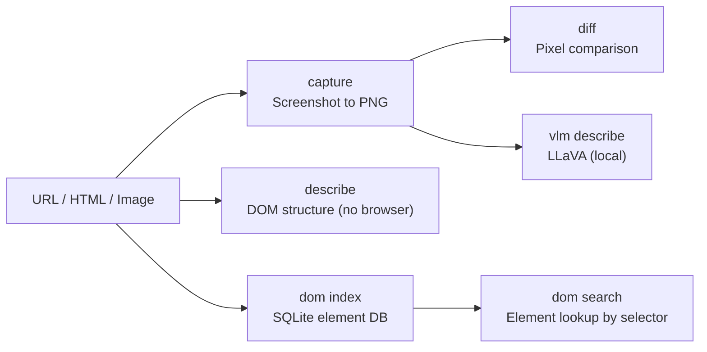

# agent-eyes — Observability and Visual QA

**Screenshot capture, pixel diff, DOM indexing, structure extraction, and local VLM-based image description.**

agent-eyes is the **visual cortex** of the Autonomic AI ecosystem. It gives AI agents the ability to "see" web pages and UIs — capturing screenshots, detecting visual regressions through pixel comparison, indexing DOM elements into a searchable SQLite database, and optionally describing images with a local LLaVA vision model.

The key design: **structure first, pixels second.** DOM indexing and structure extraction (`describe`) work without a browser — they parse HTML directly into queryable element databases. Screenshot capture and pixel diff add the visual layer on top. The local VLM (LLaVA via Candle) ensures images never leave the machine.

---

## Core Concept

AI agents are blind by default. They can read code but cannot see what the UI looks like, whether a button moved, or whether a regression introduced a visual bug.

agent-eyes bridges this gap with four capabilities that compose:

1. **Structure extraction** (`describe`) — parse HTML headings, links, forms, and interactive elements without a browser. Fast enough for every turn.
2. **DOM indexing** (`dom index`) — persist element locations in SQLite for precise targeting without re-parsing the page.
3. **Screenshot capture** (`capture`) — render a URL to a PNG for visual inspection and archiving.
4. **Pixel diff** (`diff`) — compare two screenshots with diff image output for regression detection.
5. **Local VLM** (`vlm describe`) — describe images on-device via LLaVA (optional, feature-gated).



---

## Standalone vs Integrated

| Mode | What you type | What happens |
|------|--------------|--------------|
| **Standalone** | `agent-eyes describe ./page.html` | Extract DOM structure: headings, links, forms |
| **Standalone** | `agent-eyes capture https://example.com` | Download URL to PNG file |
| **Standalone** | `agent-eyes dom index http://localhost:8765/page.html` | Index DOM into SQLite |
| **Standalone** | `agent-eyes diff before.png after.png` | Pixel diff with visual output |
| **Integrated** | HTTP daemon on `:3105` | Spine events (`eyes.captured`, `eyes.dom.indexed`) |
| **Integrated** | agent-spine | UI regression testing in workflow pipelines |

In standalone mode, eyes is a CLI visual QA tool. In integrated mode, it runs as a daemon that spine workflows query for automated UI verification.

---

## Why agent-eyes?

| Problem | agent-eyes answer |
|---------|-------------------|
| AI agents can't "see" the UI | **`capture` + `describe`** — structure analysis and screenshots |
| UI regressions go unnoticed in CI | **`diff`** — pixel comparison with diff image output |
| Re-parsing DOM every turn is wasteful | **`dom index`** — SQLite element lookup by URL, persistent across turns |
| Cloud vision sends screenshots off-device | **`vlm describe`** — local LLaVA via Candle, no data leaves your machine |

---

## What you get

| Feature | Why use it |
|---------|------------|
| **Screenshot capture** | `capture <url>` — visual artifacts for QA and archiving |
| **Pixel diff** | `diff a.png b.png` — regression detection with visual diff output |
| **DOM indexing** | `dom index <url>` — persistent SQLite element database |
| **Structure extraction** | `describe <file>` — headings, links, forms without a browser |
| **Local VLM** | `vlm describe` — on-device image captions (requires `--features vlm`) |
| **HTTP daemon** | `serve` — spine and CI integration |

DOM database: `~/.autonomic/memory/eyes_dom.db`

---

## Commands

| Command | Description |
|---------|-------------|
| `agent-eyes capture <url>` | Download URL to PNG image file |
| `agent-eyes diff <a> <b>` | Pixel diff with diff image output |
| `agent-eyes describe <file>` | Page/file structure analysis (no browser) |
| `agent-eyes verify` | UI regression check against baseline |
| `agent-eyes dom index\|file\|stats\|search` | SQLite DOM index management |
| `agent-eyes vlm describe\|status` | Local LLaVA (requires `--features vlm`) |
| `agent-eyes serve` | HTTP daemon on port 3105 |
| `agent-eyes status` | Show config, DOM stats, VLM state |

---

## HTTP API

| Method | Endpoint | Description |
|--------|----------|-------------|
| `GET` | `/health` | Daemon health |
| `POST` | `/capture` | Capture screenshot |
| `POST` | `/diff` | Pixel comparison |
| `POST` | `/dom/index` | Index DOM from URL |
| `GET` | `/dom/search` | Search indexed elements |
| `GET` | `/vlm/status` | VLM model status |
| `POST` | `/vlm/describe` | Describe image via local VLM |

---

## Quick Install

```bash
curl -fsSL https://raw.githubusercontent.com/autonomic-ai-dev/agent-eyes/master/scripts/install.sh | bash

# Or full stack:
curl -fsSL https://raw.githubusercontent.com/autonomic-ai-dev/agent-body/master/scripts/install-all-organs.sh | bash
```

Verify:
```bash
agent-eyes version
agent-eyes status
agent-eyes describe ./page.html
```

---

## Configuration

Section `[eyes]` in `~/.autonomic/config.toml` (default port **3105**).

```toml
[vlm]
enabled = true
model_id = "llava-hf/llava-1.5-7b-hf"
```

Build with VLM: `cargo build --release -p agent-eyes --features vlm`

---

## Local Setup

```bash
git clone https://github.com/autonomic-ai-dev/agent-eyes.git && cd agent-eyes
cargo build --release -p agent-eyes

# Serve a local HTML file, then index by URL:
python3 -m http.server 8765 &
agent-eyes dom index http://127.0.0.1:8765/page.html
```

---

## Development

```bash
cargo test --release -p agent-eyes
```

---

## License

MIT
