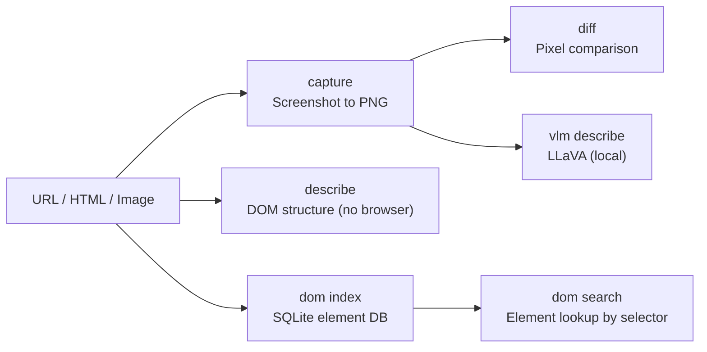

# agent-eyes — UI Observability and Visual QA

**Cloud-Native role: Observability** (traces + visual state) — DOM indexing, headless structure extraction, and OpenTelemetry integrations.

`agent-eyes` provides **state extraction** for agent-observable UIs. Agents operating on web applications need to verify UI changes, but re-parsing a massive HTML payload on every LLM turn wastes context limits. `agent-eyes` solves this by aggressively indexing DOM state into local SQLite databases and broadcasting UI regressions via OpenTelemetry.

---

## Under the Hood: How it Works

### 1. Headless Structure Extraction
Instead of launching a massive headless browser (like Puppeteer/Playwright) just to verify a button exists, `agent-eyes` parses raw HTML strings natively in Rust. It rapidly extracts headings, links, forms, and interactive elements into a compressed JSON structure (`describe`) fast enough to run on every single agent turn.

### 2. DOM Indexing (SQLite)
When an agent is crawling a complex web app, `agent-eyes` indexes the precise element locations and hierarchy into a local SQLite database (`dom index`). The agent can then use fast SQL queries to find specific elements (e.g., "find all buttons with text 'Submit'") without needing to process the entire DOM in its context window.

### 3. OpenTelemetry Integration
When `agent-eyes` detects a visual UI regression (via pixel diffing or DOM comparison), it doesn't just print to the console. It broadcasts a structured event over the NATS JetStream bus and records an OpenTelemetry trace. This allows the Autonomic CI Dashboard to visualize exactly which LLM action broke the UI layout in real-time.

### 4. Local VLM (Zero-Data-Leak Vision)
If an agent needs to "look" at a generated screenshot, sending the image to OpenAI is a massive data leak for enterprise apps. `agent-eyes` optionally boots a local **LLaVA model** via the Candle framework, generating high-quality image captions natively on-device.



---

## Standalone vs Integrated

| Mode | What you type | What happens |
|------|--------------|--------------|
| **Standalone** | `agent-eyes describe ./page.html` | Extract DOM structure: headings, links, forms |
| **Standalone** | `agent-eyes capture https://example.com` | Download URL to PNG file |
| **Standalone** | `agent-eyes dom index http://localhost:8765/page.html` | Index DOM into SQLite |
| **Standalone** | `agent-eyes diff before.png after.png` | Pixel diff with visual output |
| **Integrated** | HTTP daemon on `:3105` | Spine events (`eyes.captured`, `eyes.dom.indexed`) |
| **Integrated** | agent-spine | UI regression testing in workflow pipelines |

In standalone mode, eyes is a CLI visual QA tool. In integrated mode, it runs as a daemon that spine workflows query for automated UI verification.

---

## Why agent-eyes?

| Problem | agent-eyes answer |
|---------|-------------------|
| AI agents can't "see" the UI | **`capture` + `describe`** — structure analysis and screenshots |
| UI regressions go unnoticed in CI | **`diff`** — pixel comparison with diff image output |
| Re-parsing DOM every turn is wasteful | **`dom index`** — SQLite element lookup by URL, persistent across turns |
| Cloud vision sends screenshots off-device | **`vlm describe`** — local LLaVA via Candle, no data leaves your machine |

---

## What you get

| Feature | Why use it |
|---------|------------|
| **Screenshot capture** | `capture <url>` — visual artifacts for QA and archiving |
| **Pixel diff** | `diff a.png b.png` — regression detection with visual diff output |
| **DOM indexing** | `dom index <url>` — persistent SQLite element database |
| **Structure extraction** | `describe <file>` — headings, links, forms without a browser |
| **Local VLM** | `vlm describe` — on-device image captions (requires `--features vlm`) |
| **HTTP daemon** | `serve` — spine and CI integration |

DOM database: `~/.autonomic/memory/eyes_dom.db`

---

## Commands

| Command | Description |
|---------|-------------|
| `agent-eyes capture <url>` | Download URL to PNG image file |
| `agent-eyes diff <a> <b>` | Pixel diff with diff image output |
| `agent-eyes describe <file>` | Page/file structure analysis (no browser) |
| `agent-eyes verify` | UI regression check against baseline |
| `agent-eyes dom index\|file\|stats\|search` | SQLite DOM index management |
| `agent-eyes vlm describe\|status` | Local LLaVA (requires `--features vlm`) |
| `agent-eyes serve` | HTTP daemon on port 3105 |
| `agent-eyes status` | Show config, DOM stats, VLM state |

Global `--progress` (or `AGENT_PROGRESS=1`) enables structured ProgressTree CLI output.

---

## HTTP API

| Method | Endpoint | Description |
|--------|----------|-------------|
| `GET` | `/health` | Daemon health |
| `POST` | `/capture` | Capture screenshot |
| `POST` | `/diff` | Pixel comparison |
| `POST` | `/dom/index` | Index DOM from URL |
| `GET` | `/dom/search` | Search indexed elements |
| `GET` | `/vlm/status` | VLM model status |
| `POST` | `/vlm/describe` | Describe image via local VLM |

---

## Quick Install

```bash
curl -fsSL https://raw.githubusercontent.com/autonomic-ai-dev/agent-eyes/master/scripts/install.sh | bash

# Or full stack:
curl -fsSL https://raw.githubusercontent.com/autonomic-ai-dev/agent-body/master/scripts/install-all-organs.sh | bash
```

Verify:
```bash
agent-eyes version
agent-eyes status
agent-eyes describe ./page.html
```

---

## Configuration

Section `[eyes]` in `~/.autonomic/config.toml` (default port **3105**).

```toml
[vlm]
enabled = true
model_id = "llava-hf/llava-1.5-7b-hf"
```

Build with VLM: `cargo build --release -p agent-eyes --features vlm`

---

## Local Setup

```bash
git clone https://github.com/autonomic-ai-dev/agent-eyes.git && cd agent-eyes
cargo build --release -p agent-eyes

# Serve a local HTML file, then index by URL:
python3 -m http.server 8765 &
agent-eyes dom index http://127.0.0.1:8765/page.html
```

---

## Development

```bash
cargo test --release -p agent-eyes
```

---

## License

MIT
